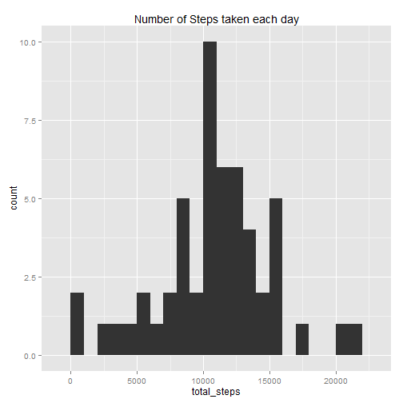
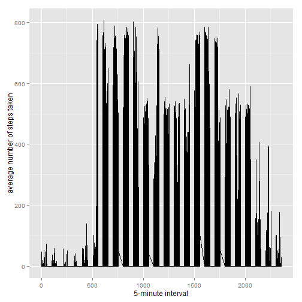
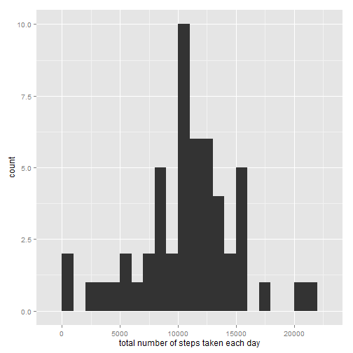

# Reproducible Research: Assignment 1

## Loading and preprocessing the data

```r
activity <- read.csv("activity.csv")
colnames(activity)
```

```
## [1] "steps"    "date"     "interval"
```

## What is mean total number of steps taken per day?

```r
library(ggplot2)
totalStepsByDate <- with(activity,aggregate(steps~date,FUN=sum))
colnames(totalStepsByDate) <- c('date','total_steps')
g <- ggplot(totalStepsByDate,aes(total_steps))
g+geom_histogram(binwidth=1000)+labs(title="Number of Steps taken each day")
```

 

```r
with(totalStepsByDate,mean(total_steps, na.rm=TRUE))
```

```
## [1] 10766
```

```r
with(totalStepsByDate,median(total_steps, na.rm=TRUE))
```

```
## [1] 10765
```

## What is the average daily activity pattern?

Firs the time series part

```r
library(ggplot2)

averageStepsByDayInterval <- with(activity,aggregate(steps~date+interval,FUN=mean))

ggplot(averageStepsByDayInterval, aes(x=interval, y=steps)) +
    geom_line() +
    xlab("5-minute interval") +
    ylab("average number of steps taken")
```

 
Now find out which day 5 minute interval has the maximum number of average steps

```r
averageStepsByDay5MinuteInterval <- averageStepsByDayInterval[averageStepsByDayInterval$interval==5,]

print(averageStepsByDay5MinuteInterval[which.max(averageStepsByDay5MinuteInterval$steps),"date"])
```

```
## [1] 2012-10-10
## 61 Levels: 2012-10-01 2012-10-02 2012-10-03 2012-10-04 ... 2012-11-30
```


## Imputing missing values

There are many days/intervals where there are missing values (coded as `NA`). The presence of missing days may introduce bias into some calculations or summaries of the data.


```r
data <- activity
missing <- is.na(data$steps)
# How many missing
table(missing)
```

```
## missing
## FALSE  TRUE 
## 15264  2304
```

All of the missing values are filled in with mean value for that 5-minute
interval.


```r
# Replace each missing value with the mean value of its 5-minute interval
fill.value <- function(steps, interval) {
    filled <- NA
    if (!is.na(steps))
        filled <- c(steps)
    else
        filled <- (averages[averages$interval==interval, "steps"])
    return(filled)
}
filled.data <- data
filled.data$steps <- mapply(fill.value, filled.data$steps, filled.data$interval)
```

```
## Error: object 'averages' not found
```
Now, using the filled data set, let's make a histogram of the total number of steps taken each day and calculate the mean and median total number of steps.


```r
total.steps <- tapply(filled.data$steps, filled.data$date, FUN=sum)
qplot(total.steps, binwidth=1000, xlab="total number of steps taken each day")
```

 

```r
mean(total.steps)
```

```
## [1] NA
```

```r
median(total.steps)
```

```
## <NA> 
##   NA
```

Mean and median values are higher after imputing missing data. The reason is
that in the original data, there are some days with `steps` values `NA` for 
any `interval`. The total number of steps taken in such days are set to 0s by
default. However, after replacing missing `steps` values with the mean `steps`
of associated `interval` value, these 0 values are removed from the histogram
of total number of steps taken each day.

## Are there differences in activity patterns between weekdays and weekends?
First, let's find the day of the week for each measurement in the dataset. In
this part, we use the dataset with the filled-in values.


```r
weekday.or.weekend <- function(date) {
    day <- weekdays(date)
    if (day %in% c("Monday", "Tuesday", "Wednesday", "Thursday", "Friday"))
        return("weekday")
    else if (day %in% c("Saturday", "Sunday"))
        return("weekend")
    else
        stop("invalid date")
}
filled.data$date <- as.Date(filled.data$date)
filled.data$day <- sapply(filled.data$date, FUN=weekday.or.weekend)
```

Now, let's make a panel plot containing plots of average number of steps taken
on weekdays and weekends.

```r
averages <- aggregate(steps ~ interval + day, data=filled.data, mean)
ggplot(averages, aes(interval, steps)) + geom_line() + facet_grid(day ~ .) +
    xlab("5-minute interval") + ylab("Number of steps")
```

 
